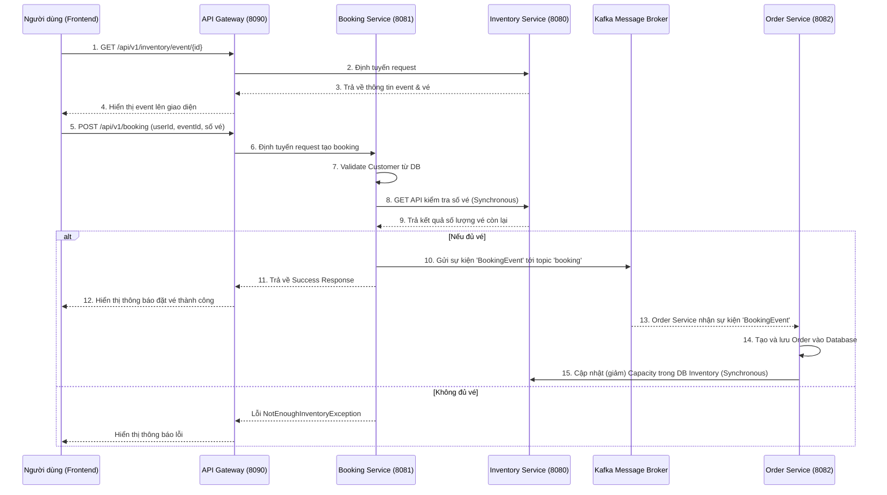

# EventTick - Ticketing Microservices Project

Một hệ thống backend microservices mạnh mẽ dành cho nền tảng đặt vé sự kiện (EventTick), được xây dựng bằng Java 21 và Spring Boot 3. Dự án áp dụng kiến trúc Microservices kết hợp với giao tiếp đồng bộ (Synchronous) và bất đồng bộ (Asynchronous) qua Kafka, đảm bảo tính khả mở, chịu lỗi cao và hiệu suất tốt.

## 🏗 Kiến trúc dự án (Architecture)

Dự án bao gồm các thành phần và services chính sau:

1. **API Gateway (Cổng giao tiếp)** - Chạy ở Port `8090`
   - Định tuyến các request từ Frontend đến các services tương ứng.
   - Quản lý bảo mật phân quyền thông qua **Keycloak** (OAuth2 Resource Server).
   - Tích hợp **Resilience4j** (Circuit Breaker, Retry, TimeLimiter) để bảo vệ hệ thống khỏi các lỗi lan truyền.
   - Cung cấp Swagger UI tổng hợp document API cho toàn bộ hệ thống.

2. **Inventory Service (Quản lý kho vé/sự kiện)** - Chạy ở Port `8080` (nằm trong thư mục `version-1/microservices`)
   - Cung cấp API thông tin sự kiện, tổng số vé, và số lượng vé còn lại.
   - Nhận yêu cầu trừ số lượng vé sau khi order được tạo.
   - Quản lý database bằng **Flyway**.

3. **Booking Service (Dịch vụ đặt vé)** - Chạy ở Port `8081`
   - Tiếp nhận yêu cầu đặt vé từ người dùng.
   - Gọi đồng bộ đến `Inventory Service` qua RestClient/Feign để kiểm tra số lượng vé.
   - Bắn sự kiện (Event) vào **Kafka** (Topic: `booking`) sau khi đặt vé hợp lệ.
   - Kết nối với MySQL để lấy thông tin `Customer`.

4. **Order Service (Dịch vụ xử lý đơn hàng)** - Chạy ở Port `8082`
   - Lắng nghe sự kiện (Consumer) từ **Kafka** trên topic `booking`.
   - Tạo đơn hàng (Order) và lưu vào cơ sở dữ liệu MySQL.
   - Gọi API đồng bộ cập nhật lại (giảm) số lượng vé khả dụng bên `Inventory Service`.

5. **Frontend (Giao diện người dùng)**
   - Nằm trong thư mục `frontend/`.
   - Được xây dựng bằng HTML, CSS (Minimalist & Glassmorphism Design), Vanilla JavaScript.
   - Giao tiếp với API Gateway để tìm kiếm sự kiện và thực hiện đặt vé.

---

## 🛠 Công nghệ sử dụng (Tech Stack)

- **Ngôn ngữ & Framework:** Java 21, Spring Boot 3.4.x / 3.5.x
- **Microservices & Cloud:** Spring Cloud Gateway MVC
- **Bảo mật:** OAuth2, Keycloak
- **Giao tiếp liên dịch vụ:** REST API, Apache Kafka
- **Resilience & Fault Tolerance:** Resilience4j (Circuit Breaker, Retry)
- **Cơ sở dữ liệu:** MySQL 8, Spring Data JPA, Flyway (Migration)
- **Tài liệu API:** SpringDoc OpenAPI (Swagger UI)
- **Frontend:** Vanilla JS, HTML5, CSS3

---

## 🔄 Luồng hoạt động của hệ thống (System Flow)

Dưới đây là luồng xử lý chi tiết khi người dùng thực hiện **Đặt vé (Book Ticket)**:

### Các bước cụ thể trong luồng đặt vé:
1. Người dùng nhập User ID, Event ID và số lượng vé cần mua trên UI.
2. Yêu cầu (Request) đi qua **API Gateway**, gateway xác thực token (qua Keycloak nếu có) và điều phối tới **Booking Service**.
3. **Booking Service** gọi API đồng bộ sang **Inventory Service** để kiểm tra xem số lượng vé yêu cầu có vượt quá sức chứa hiện tại (`leftCapacity`) hay không.
4. Nếu đủ vé:
   - **Booking Service** đóng gói một `BookingEvent` bao gồm thông tin chi phí và số lượng, sau đó bắn sự kiện này vào topic `booking` trên **Kafka**.
   - Trả phản hồi ngay lập tức cho Frontend báo Đặt vé thành công.
5. Ở Background, **Order Service** là consumer của topic `booking` sẽ bắt được sự kiện này:
   - Nó lưu chi tiết Đơn hàng (Order) vào Database của Order Service.
   - Nó thực hiện gọi API đồng bộ quay lại **Inventory Service** để cập nhật (giảm) số lượng vé khả dụng của event đó.

---

## 🚀 Hướng dẫn cài đặt và chạy dự án (Getting Started)

### Yêu cầu hệ thống:
- JDK 21
- Maven
- MySQL chạy ở port `3103` (database name: `ticketing`, user: `root`, pass: `password`)
- Apache Kafka chạy ở port `9092`
- Keycloak chạy ở port `8091` (Realm: `ticketing`)

### Các bước chạy:
1. **Khởi động các dịch vụ phụ trợ:** Đảm bảo MySQL, Kafka và Keycloak đã được khởi động đúng port như cấu hình trong `application.properties`.
2. **Chạy Inventory Service:** 
   Đi tới `version-1/microservices` và chạy `mvn spring-boot:run`. Dịch vụ này sẽ sử dụng Flyway để tự động tạo schema database.
3. **Chạy Booking Service & Order Service:**
   Mở từng thư mục `bookingservice` và `orderservice` chạy `mvn spring-boot:run`.
4. **Chạy API Gateway:**
   Mở thư mục `apigateway` chạy `mvn spring-boot:run`.
5. **Mở Frontend:**
   Mở file `frontend/index.html` trực tiếp trên trình duyệt hoặc sử dụng Live Server của VS Code để trải nghiệm giao diện người dùng.

---

## 🔍 Tính năng chính của hệ thống

- **Tra cứu sự kiện:** Hiển thị thông tin Event, tổng sức chứa và số vé còn lại.
- **Xử lý giao dịch phân tán (Distributed Transactions):** Đặt vé thông qua Event-Driven Architecture (Saga/Choreography) giúp hệ thống không bị nghẽn (Non-blocking) cho người dùng cuối.
- **Tính chịu lỗi (Fault Tolerance):** Khả năng ngăn chặn hệ thống bị sập dây chuyền bằng Circuit Breaker của Resilience4j tại API Gateway.
- **Bảo mật:** Quản lý quyền truy cập tập trung vào các microservices bằng Keycloak.
- **Tự động Document API:** Sử dụng OpenAPI (Swagger) tập trung hóa qua API Gateway để xem tài liệu của tất cả các microservices tại một nơi.
