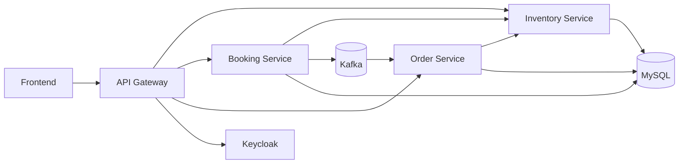

# EventTick - Ticketing Microservices Platform

EventTick is a portfolio-grade event ticketing system built with Java 21, Spring Boot, Kafka, MySQL, Keycloak, Docker, and a lightweight vanilla JavaScript frontend.

The project demonstrates a common microservices workflow: users search available events, book tickets through a booking service, publish booking events to Kafka, and let an order service consume those events and update inventory asynchronously.

## Architecture


```mermaid
flowchart LR
    UI[Frontend] --> GW[API Gateway]
    GW --> INV[Inventory Service]
    GW --> BOOK[Booking Service]
    GW --> ORD[Order Service]
    BOOK --> INV
    BOOK --> KAFKA[(Kafka)]
    KAFKA --> ORD
    ORD --> INV
    INV --> DB[(MySQL)]
    BOOK --> DB
    ORD --> DB
    GW --> KC[Keycloak]
```

## Services

| Service | Port | Responsibility |
| --- | ---: | --- |
| Frontend | 3000 | Event search, ticket booking, order history, admin event form |
| API Gateway | 8090 | Routing, OAuth2 resource server, Swagger aggregation, circuit breaker |
| Inventory Service | 8080 | Events, venues, ticket capacity, Flyway migrations |
| Booking Service | 8081 | Customer validation, inventory check, Kafka booking event producer |
| Order Service | 8082 | Kafka booking event consumer, order persistence, capacity update |
| Keycloak | 8091 | Demo authentication and realm roles |
| Kafka UI | 8084 | Kafka topic inspection |
| MySQL | 3103 | Shared demo database |

## Tech Stack

- Java 21, Spring Boot 3
- Spring Cloud Gateway MVC
- Spring Security OAuth2 Resource Server
- Keycloak
- Apache Kafka
- MySQL 8, Spring Data JPA, Flyway
- SpringDoc OpenAPI / Swagger UI
- Docker Compose
- Vanilla HTML, CSS, JavaScript
- JUnit 5, Mockito, H2 test profile

## Demo Data

Flyway seeds demo data automatically:

| Type | ID | Value |
| --- | ---: | --- |
| Customer | 1 | Demo Customer |
| Event | 1 | Java Microservices Summit |
| Event | 2 | Cloud Native Night |

Keycloak demo users:

| Username | Password | Roles |
| --- | --- | --- |
| customer | customer123 | CUSTOMER |
| admin | admin123 | CUSTOMER, ADMIN |

## Run With Docker

From the repository root:

```powershell
cd version-1/microservices
docker compose up --build
```

Open:

- Frontend: http://localhost:3000
- API Gateway Swagger: http://localhost:8090/swagger-ui.html
- Keycloak Admin: http://localhost:8091
- Kafka UI: http://localhost:8084

Keycloak admin credentials:

```text
username: admin
password: admin
```

If Docker Desktop is not running, start it first and rerun the command above. The stack builds all Java services inside Docker, so a local Maven installation is not required for the Docker demo.

## Smoke Test

After the Docker stack is running, execute the end-to-end smoke test from the repository root:

```powershell
powershell -ExecutionPolicy Bypass -File .\scripts\smoke-test.ps1
```

The script logs in through Keycloak, reads demo event `1`, creates a booking for customer `1`, waits for Kafka consumption, and verifies the order history through the API Gateway.

## Run Tests

Each service can be tested independently.

Windows:

```powershell
powershell -ExecutionPolicy Bypass -File .\scripts\test-all.ps1
```

Or run each service manually:

```powershell
cd apigateway
.\mvnw.cmd test

cd ..\bookingservice
.\mvnw.cmd test

cd ..\orderservice
.\mvnw.cmd test

cd ..\version-1\microservices
.\mvnw.cmd test
```

macOS/Linux:

```bash
cd apigateway && ./mvnw test
cd ../bookingservice && ./mvnw test
cd ../orderservice && ./mvnw test
cd ../version-1/microservices && ./mvnw test
```

The Spring Boot context tests use the `test` profile with H2, so they do not require a local MySQL or Kafka instance.

## CI

GitHub Actions runs every service test suite independently and validates the Docker Compose configuration on pushes and pull requests. See `.github/workflows/ci.yml`.

## Main Flow

1. A user logs in through Keycloak.
2. The frontend calls the API Gateway with a bearer token.
3. Booking Service validates the customer and checks ticket availability from Inventory Service.
4. Booking Service publishes a `BookingEvent` to Kafka.
5. Order Service consumes the event, creates an order, and asks Inventory Service to reduce capacity.
6. The user can view and cancel orders from the frontend.

## Useful Endpoints

| Method | Path | Description |
| --- | --- | --- |
| GET | `/api/v1/inventory/events` | List all events |
| GET | `/api/v1/inventory/event/{eventId}` | Get event inventory |
| POST | `/api/v1/booking` | Book tickets |
| GET | `/orders/history?CustomerID=1` | Get customer orders |
| DELETE | `/orders/{orderId}/cancel` | Cancel an order |

## Portfolio Summary

Built an event-ticketing microservices platform with Spring Boot, Kafka, API Gateway, Keycloak authentication, MySQL/Flyway migrations, Docker Compose, Swagger documentation, and automated service tests.

## Roadmap

- Add integration tests with Testcontainers for MySQL and Kafka.
- Replace manual `CustomerID` entry with a customer profile mapped from Keycloak identity.
- Add role-based protection for admin inventory endpoints.
- Split the shared database into service-owned schemas.
- Add CI with GitHub Actions.
