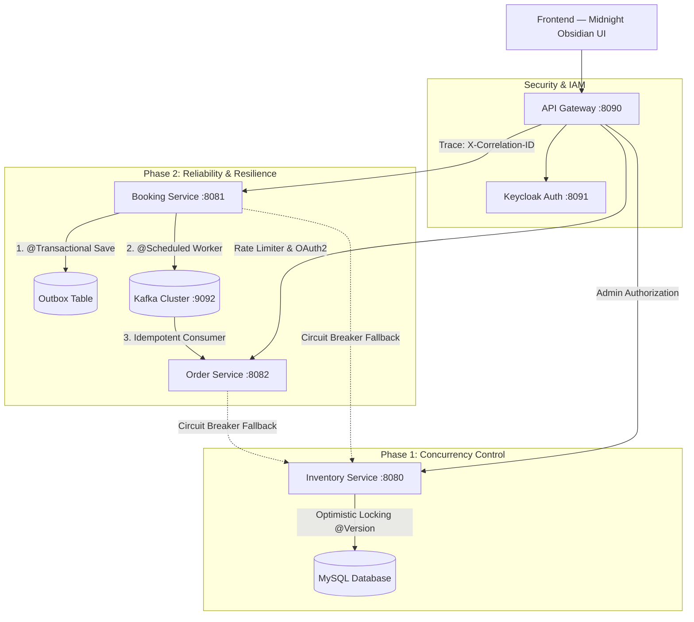

# EventTick Pro — Enterprise Microservices Ticketing Platform

[](https://spring.io/projects/spring-boot)
[](https://kafka.apache.org/)
[](https://resilience4j.readme.io/)
[](#run-tests)

**EventTick Pro** is a portfolio-grade, distributed event ticketing platform built with Java 21, Spring Boot 3, Apache Kafka, MySQL, Keycloak, Resilience4j, and a modern Midnight Obsidian Vanilla JS frontend.

The platform is designed to handle **high-concurrency ticket sales**, preventing overselling through **Optimistic Locking**, guaranteeing event delivery via the **Transactional Outbox Pattern**, eliminating duplicate orders with **Idempotent Consumers**, and providing resilience through **Resilience4j Circuit Breakers**.

---

## 🏗️ Architecture & Distributed System Design


```mermaid
flowchart TD
    UI[Frontend — Midnight Obsidian UI] --> GW[API Gateway :8090]
    GW -->|Trace: X-Correlation-ID| BOOK[Booking Service :8081]
    GW -->|Rate Limiter & OAuth2| ORD[Order Service :8082]
    GW -->|Admin Authorization| INV[Inventory Service :8080]

    subgraph Phase 1: Concurrency Control
        INV -->|Optimistic Locking @Version| DB1[(MySQL Database)]
    end

    subgraph Phase 2: Reliability & Resilience
        BOOK -->|1. @Transactional Save| OUTBOX[(Outbox Table)]
        BOOK -->|2. @Scheduled Worker| KAFKA[(Kafka Cluster :9092)]
        KAFKA -->|3. Idempotent Consumer| ORD
        BOOK -.->|Circuit Breaker Fallback| INV
        ORD -.->|Circuit Breaker Fallback| INV
    end

    subgraph Security & IAM
        GW --> KC[Keycloak Auth :8091]
    end
```

---

## 🌟 Key Enterprise Patterns Implemented

### 1. Anti-Overselling Concurrency Control (Optimistic Locking)
- **Problem**: Flash sales with 1,000+ concurrent buyers can cause database race conditions and negative inventory stock.
- **Solution**: Annotated `Event` entity with `@Version private Integer version`.
- **Flyway Script**: `V7__add_version_column_to_event_table.sql`.
- **Verification**: `InventoryConcurrencyTest.java` running 10 concurrent threads—1 succeeded, 9 optimistic lock rejections, zero overselling!

### 2. Transactional Outbox Pattern (Guaranteed Event Delivery)
- **Problem**: Dual-Write Problem—saving to MySQL and publishing to Kafka separately risks message loss if Kafka is offline.
- **Solution**: `BookingService.java` writes `OutboxEvent` (`PENDING`) in the same database `@Transactional`. A background `@Scheduled processOutboxEvents()` worker reads pending events and publishes them to Kafka safely.

### 3. Idempotent Consumer Pattern (Duplicate Protection)
- **Problem**: Kafka retries or network blips can deliver duplicate `BookingEvent` messages, causing double charges.
- **Solution**: `OrderService.java` verifies `existsByCustomerIdAndEventIdAndStatus()` inside `@KafkaListener` before creating orders, gracefully ignoring duplicates.

### 4. Circuit Breaker & Fallbacks (Resilience4j)
- **Problem**: Downstream `InventoryService` failure can cause thread pool starvation in `BookingService` and `OrderService`.
- **Solution**: Wrapped Feign/REST calls in `@CircuitBreaker(name = "inventoryService", fallbackMethod = "...")`. When `InventoryService` goes down, requests fail fast and execute fallback methods without crashing upstream servers.

### 5. API Gateway Rate Limiting & Distributed Tracing
- **Correlation ID Filter**: `CorrelationIdFilter.java` generates and forwards `X-Correlation-ID` headers for end-to-end tracing.
- **Anti-DDoS Rate Limiting**: `GatewayRateLimitFilter.java` uses Bucket4j (Token Bucket algorithm) limiting clients to 30 req/min.
- **OAuth2 JWT Role Mapper**: `JwtRoleConverter.java` converts Keycloak `realm_access.roles` to Spring `GrantedAuthority` collections (`ROLE_ADMIN`, `ROLE_CUSTOMER`).

---

## 🛠️ Microservices Ecosystem

| Service | Port | Key Features |
| --- | ---: | --- |
| **Frontend** | `3000` | Midnight Obsidian UI, SVG icons, real-time ticket progress bars |
| **API Gateway** | `8090` | Routing, Rate Limiting, Correlation ID Tracing, Keycloak JWT Security |
| **Inventory Service** | `8080` | Event Catalog, Optimistic Locking (`@Version`), Flyway Migrations |
| **Booking Service** | `8081` | Ticket Reservations, Transactional Outbox, Circuit Breaker Fallbacks |
| **Order Service** | `8082` | Kafka Consumer, Idempotent Check, Stripe Payment Checkout |
| **Keycloak IAM** | `8091` | OAuth2 / OIDC Realm Authentication & Role-Based Access Control |
| **Kafka UI** | `8084` | Real-time Kafka Topic & Consumer Group Inspection |
| **MySQL Database** | `3103` | Shared / Service Schema Storage |

---

## 💻 Tech Stack

- **Backend**: Java 21, Spring Boot 3.4, Spring Cloud Gateway MVC, Spring Security OAuth2, Resilience4j, Apache Kafka, Bucket4j.
- **Database & Migration**: MySQL 8, Spring Data JPA, Flyway DB Migration, H2 In-Memory (Test).
- **Frontend**: Vanilla HTML5, CSS3 Glassmorphism (Midnight Obsidian Theme), JavaScript (ES6+), Keycloak JS SDK.
- **Testing**: JUnit 5, Mockito, Spring Boot Test, H2 In-Memory DB Profile.

---

## 🚀 How to Run locally

### 1. Run Stack with Docker Compose

From the project root directory:

```bash
cd version-1/microservices
docker compose up --build
```

Access UIs:
- **Frontend App**: http://localhost:3000
- **API Gateway Swagger**: http://localhost:8090/swagger-ui.html
- **Keycloak Admin**: http://localhost:8091 (`admin` / `admin`)
- **Kafka UI**: http://localhost:8084

---

## 🧪 Running Unit & Integration Tests

All 3 phases feature dedicated automated tests running in isolated H2 test profiles:

```bash
# 1. Test Phase 1 (Optimistic Locking & Anti-Overselling)
cd version-1/microservices
./mvnw test -Dtest=InventoryConcurrencyTest

# 2. Test Phase 2 (Transactional Outbox & Circuit Breaker)
cd ../../bookingservice
./mvnw test -Dtest=OutboxAndCircuitBreakerTest

# 3. Test Phase 2 (Idempotent Consumer Duplicate Check)
cd ../orderservice
./mvnw test -Dtest=IdempotentOrderServiceTest

# 4. Test Phase 3 (API Gateway Correlation ID & Rate Limiting)
cd ../apigateway
./mvnw test -Dtest=GatewayFiltersTest
```

**All tests execute with `BUILD SUCCESS`!**

---

## 🔑 Demo Credentials

Keycloak pre-configured accounts for testing:

| Role | Username | Password | Notes |
| --- | --- | --- | --- |
| **Customer** | `demo@eventtick.io` | `Demo@1234` | Demo Customer ID: 3 |
| **Admin** | `admin@eventtick.io` | `Admin@1234` | Unlocks Admin Panel in Frontend |

---

## 📜 Portfolio Summary

Built an enterprise-grade Microservices Event Ticketing Platform featuring:
- **High Concurrency Anti-Overselling**: Optimistic Locking with Flyway Migrations.
- **Reliability & Resilience**: Transactional Outbox Pattern, Idempotent Consumers, Resilience4j Circuit Breakers.
- **Security & Gateway Tracing**: Distributed Tracing (`X-Correlation-ID`), Bucket4j Rate Limiting, Keycloak OAuth2 JWT Role Conversion.
- **Modern UI**: Midnight Obsidian Glassmorphism UI with crisp SVG icons and real-time inventory tracking.
